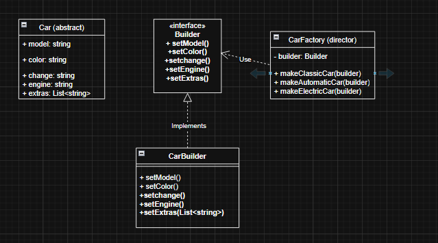

### First Pattern

Tenemos una Fábrica de coches y queremos implementar una aplicación para la construcción de un coche por pasos. En cada paso del configurador vamos a ir añadiendo cada uno de los elementos que componen el coche.

Un coche tiene las siguientes características:

    Modelo
    Color
    Cambio (Automático o Manual)
    Motor (Gasolina, Diesel, Eléctrico)
    Extras (GPS, Techo Solar o Asientos Calefactables)

El Modelo, Color, Cambio y Motor son obligatorios y solo se puede elegir uno. Los Extras son opcionales y se pueden elegir varios.

    De los 3 clasificaciones de problemas que tenemos en patrones, ¿Cuál crees que es el problema que estamos intentando resolver?
    # Respuesta:
    Estamos intentando resolver un problema creacional, ya que hablamos de como construir un coche. 

    ¿Qué patrón de diseño crees que se ajusta mejor a la solución de este problema?
    # Respuesta:
    Seria el builder ya que se trata de un objeto complejo, que tiene muchas características que se pueden ir añadiendo al crear, lo que resultaría en un constructor kilométrico, para evitar eso el patrón builder nos ayuda a crear objetos a través de metodos que añaden la configuración que se quiere, por pasos. 

    Diseñar e implementar la solución con un Diagrama UML y el código
    # Respuesta:

    

TODO código
